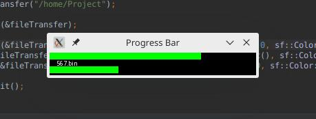

# ProgressBar
A simple progress bar made with SFML that mimics the transfer of a directory using Observer design pattern.  
To start the transfer, press enter!  
If the window is closed during the transfer, the transfer will be canceled  
